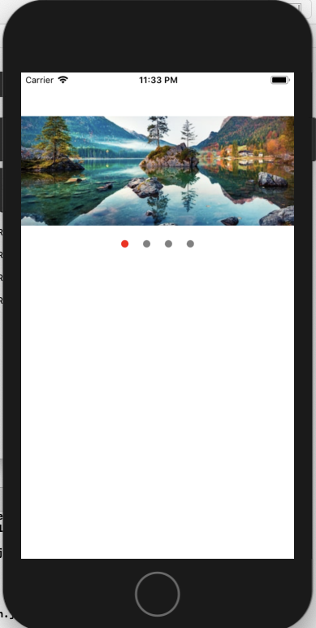

#react-native-view-slider
A robust simple lightweight library for sliding views/images/anything in react-native applications.

- Support
  -> React native => 0.59.0
  -> This module will support both expo managed application and bare react native applications.

 

# Install the library

    npm i react-native-view-slider

# Import

    import ViewSlider from 'react-native-view-slider'

# Using in application

    import React from 'react';
    import {
    StyleSheet,
    View,
    Text,
    Dimensions
    } from 'react-native';
    import ViewSlider from 'react-native-view-slider'

    const { width, height } = Dimensions.get('window');

    function App() {
      return (
        <>
          <View_Slider 
            renderSlides = {
              <>
                <View style={styles.viewBox}>
                  <Image source={{uri: 'https://image.shutterstock.com/image-photo/beautiful-autumn-scene-hintersee-lake-260nw-747646759.jpg'}} style={{height: 200, width}}/>
                </View>
                <View style={styles.viewBox}><Text>TWO</Text></View>
                <View style={styles.viewBox}><Text>THREE</Text></View>
                <View style={styles.viewBox}><Text>FOUR</Text></View>
             </>
          }
          style={styles.slider}     //Main slider container style
          height = {200}    //Height of your slider
          slideCount = {4}    //How many views you are adding to slide
          dots = {true}     // Pagination dots visibility true for visibile 
          dotActiveColor = 'red'     //Pagination dot active color
          dotInactiveColor = 'gray'    // Pagination do inactive color
          dotsContainerStyle={styles.dotContainer}     // Container style of the pagination dots
          autoSlide = {true}    //The views will slide automatically
          slideInterval = {1000}    //In Miliseconds
         />
        </>
      );
    };

    const styles = StyleSheet.create({
      viewBox: {
          paddingHorizontal: 20,
          justifyContent: 'center',
          width: width,
          padding: 10,
          alignItems: 'center',
          height: 150
      },
      slider: {
          alignSelf: 'center',
          justifyContent: 'center',
          alignItems: 'center',
          backgroundColor: 'pink'
      },
      dotContainer: {
        backgroundColor: 'transparent'
      }
    });

    export default App;

# Props

* renderSlides : Views/sliders content 
* style : slider container style[ Full customize your slider container with style prop ]
* height : Your slider height
* slideCount : Number of slides you are giving [Required]
* dots : default false [If you want the slider dots to be shown set it to true]
* dotActiveColor : active dot color
* dotInactiveColor : Inactive dot color 
* dotsContainerStyle
